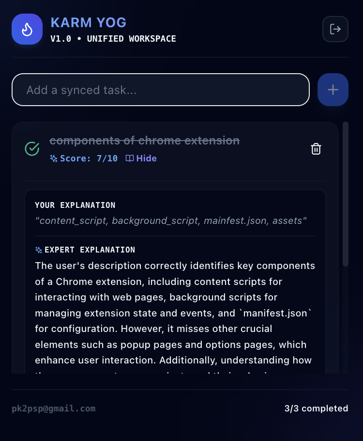
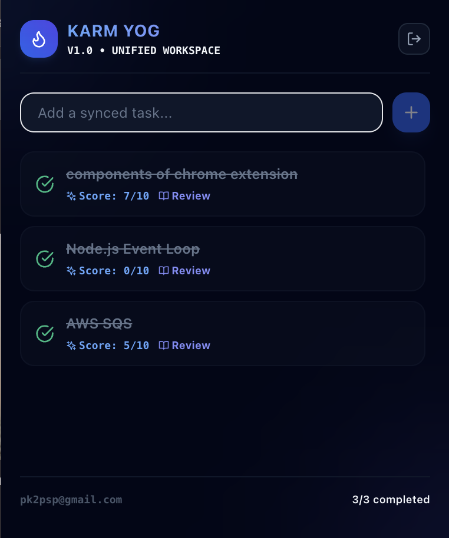

#  Karm Yog — Unified Workspace & AI Career Companion

**Karm Yog** is a sleek, glassmorphic, enterprise-grade Chrome Extension designed specifically for developers and tech-career job hunters. It helps you capture task targets, organize learning tracks, and actively verify your engineering comprehension using automated event-driven AI evaluations.

<p align="center">
  
  
</p>

---

## ✨ Features

- **Hotkey Quick Capture (`Option + Shift + T`):** Capture any complex technical focus area or topic instantly via a sleek modal.
- **Hotkey Workspace Checklist (`Option + Shift + V`):** Open your sliding workspace checklist directly in any web page to track your focus areas.
- **Active AI Evaluation:** Checking off a task requires summarizing your technical understanding of the topic. A secure Supabase Edge Function calls `gpt-4o-mini` to instantly score your understanding (1-10) and write back an expert explanation.
- **Real-Time Workspace Sync:** Uses Supabase Auth and Row-Level Security (RLS) to synchronize your tasks across all your open tabs, browser contexts, and the extension popup in real-time.
- **Enterprise-Grade Security:** Fully gates all task features behind a verified Supabase login. Stale sessions are automatically flushed to prevent unauthenticated access.

---

## 🛠️ Tech Stack & Advanced Architecture

The extension is engineered for high performance, isolation, and seamless real-time syncing. 

| Layer | Technology | Developer Rationale & Architecture Details |
| :--- | :--- | :--- |
| **Frontend UI** | **React 18** & **TypeScript** | Strict component compilation with modular state. Features fully typed datastructures matching Supabase schemas. |
| **Style Isolation** | **Vanilla CSS** & **TailwindCSS 3** | Compiled inline stylesheet injected directly inside a isolated **Shadow DOM container** in standard web pages, preventing host-site CSS leakage or conflicts. |
| **Build System** | **Vite 5** & **Vite loadEnv** | Sequentially bundles self-contained IIFEs for Background and Content scripts. Embeds React/ReactDOM natively inside the content script so it functions flawlessly on high-security system tabs. |
| **Backend & Sync** | **Supabase DB & Real-time** | Low-latency storage sync using Row-Level Security (RLS) policies. Restricts database read/write access strictly to authenticated workspace users. |
| **Authentication** | **Supabase Auth** | Custom token handshake. Automatically synchronizes valid access/refresh tokens in real-time across tabs using `chrome.storage.local` with proactive backend validation. |
| **Serverless Pipeline** | **Deno Edge Functions** | Event-driven webhooks. Intercepts task updates securely, calling AI models off the client-side to hide sensitive API keys. |
| **AI Evaluation** | **OpenAI GPT-4o-Mini** | Evaluates technical interview concepts and provides score evaluations and constructive feedback. |

---

## 🚀 One-Step Installation & Launch

To install **Karm Yog** in Developer Mode on your Google Chrome browser:

### 1. Build the Extension
Ensure you have Node.js installed, then run the following in your terminal to install dependencies and compile the extension:
```bash
npm install && npm run build
```
*(This builds a compiled, zero-dependency, isolated extension bundle directly in the `dist/` directory).*

### 2. Load it into Google Chrome
1. Open a new tab in Chrome and navigate to: **`chrome://extensions/`**
2. Toggle **Developer mode** on (top-right corner).
3. Click the **Load unpacked** button (top-left corner).
4. Select the compiled **`karm_yog/dist`** folder on your computer.

*🎉 **Done!** The extension icon (the cute smart digital flame) will appear in your extension toolbar. Pin it and start syncing!*

---

## 🎹 Global Shortcuts

Use these custom hotkeys to trigger the extension overlays from any tab:

- **`Option + Shift + T`** *(or `Alt + Shift + T`)*: Open/Close Quick Task Capture Modal.
- **`Option + Shift + V`** *(or `Alt + Shift + V`)*: Open/Close Tab Workspace Checklist.
- **`Escape`**: Dismiss any open overlay.

---

## ☁️ Supabase Backend Configuration (If setting up your own backend)

If you are deploying your own version of the backend:

1. **Database Schema:**
   Run the SQL code inside `supabase/migrations/initialize.sql` in your Supabase SQL Editor to initialize the `tasks` schema and activate RLS policies.

2. **OpenAI Secrets Configuration:**
   Add your OpenAI API key in your Supabase Project Settings under **Edge Functions**:
   ```bash
   npx supabase secrets set OPENAI_API_KEY=your_key_here
   ```

3. **Deploy Edge Function:**
   ```bash
   npx supabase login
   npx supabase link --project-ref <your-project-ref>
   npx supabase functions deploy analyze-understanding
   ```

4. **Webhooks Setup:**
   Enable a database webhook on your Supabase dashboard pointing `UPDATE` events on the `tasks` table to the `analyze-understanding` Edge Function.
